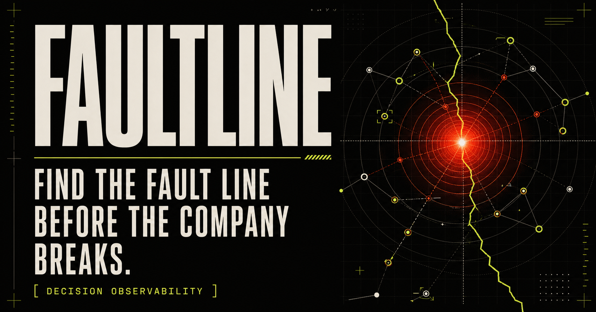
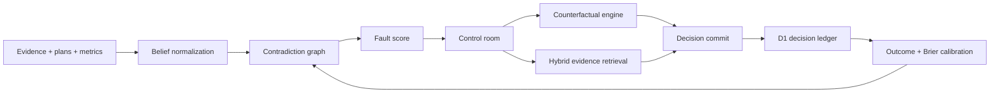

# FAULTLINE

[](https://github.com/shauryamalhotra957-wq/faultline-decision-observability/actions) [](https://opensource.org/licenses/MIT)


> Decision observability for teams operating under uncertainty.



Most decision software helps a team document what it chose. FAULTLINE instruments the belief system behind the choice: the claims, contradictions, evidence quality, uncertainty, simulated downside, and eventual calibration error.

It is an industry-grade research prototype for a new product category—**decision observability**—built as a complete Cloudflare-native application rather than a dashboard mockup.

## What makes it different

The current decision-intelligence market is converging on AI councils, natural-language analytics, generic scenario planning, and decision ledgers. Those are useful, but they largely start after a person asks a question or decides to record an answer.

FAULTLINE starts one layer earlier. It continuously asks:

- Which beliefs inside the organization cannot all be true?
- Which high-confidence claim is backed by low-coverage evidence?
- Which assumption has drifted since the plan was approved?
- What is the cheapest next piece of evidence that would change the decision?
- Was the team actually calibrated when the outcome arrived?

The result is closer to Datadog for organizational judgment than another chat window.

## Product surfaces

| Surface | Purpose | Implementation |
| --- | --- | --- |
| Fault Radar | Ranks strategic contradictions by tension, impact, drift, and evidence coverage | Typed decision-signal model and explainable scoring |
| Scenario Lab | Rehearses a decision across uncertain demand, price, capacity, and retention | Seeded Monte Carlo engine with 5,000 deterministic paths |
| Evidence Mesh | Retrieves relevant evidence while preserving source, stance, reliability, and recency | Hybrid lexical retrieval, semantic expansion, and reliability reranking |
| Decision Ledger | Seals the pre-outcome belief state so hindsight cannot rewrite it | Cloudflare D1, SHA-256 integrity digests, migrations |
| Calibration Loop | Scores confidence against resolved outcomes | Brier scoring primitive and outcome schema |

## Engineering highlights

- Next.js-compatible React 19 application on [vinext](https://github.com/cloudflare/vinext)
- Cloudflare Worker-compatible ESM output
- D1 relational schema for decisions, evidence, simulations, and outcomes
- Deterministic simulation engine—no hidden API call required
- Provenance-first retrieval with no fabricated citations
- Runtime validation, bounded inputs, prepared SQL, and integrity hashing
- Responsive interaction design with keyboard focus and reduced-motion support
- Production metadata and a purpose-built social preview
- Unit, server-render, metadata, and starter-cleanup tests
- GitHub Actions CI and a documented security model

## Architecture



See [docs/ARCHITECTURE.md](docs/ARCHITECTURE.md) for boundaries, data flow, schema rationale, and production evolution.

## Local development

Requirements: Node.js 22.13 or newer and npm.

```bash
npm ci
npm run dev
```

Open `http://localhost:3000`.

The application uses a local Miniflare-backed D1 binding in development. Tables are initialized defensively with prepared statements; generated migrations remain the source of truth for deployments.

## Verification

```bash
npm test
npm run lint
npm run db:generate
```

`npm test` performs a production build before running the deterministic engine and server-render tests.

## API

### `POST /api/simulate`

Runs a bounded, seeded counterfactual model.

```json
{
  "input": {
    "adoption": 67,
    "priceDelta": 8,
    "capacity": 88,
    "retention": 91
  },
  "seed": 71071
}
```

### `POST /api/retrieve`

Returns relevance-ranked evidence packets with stance, reliability, source, and an explainable match reason.

```json
{ "query": "What blocks a safe EMEA launch?" }
```

### `GET|POST /api/decisions`

Reads or creates immutable pre-commit records. User input is length-bounded, confidence is clamped, SQL is parameterized, and the record receives a SHA-256 digest.

## Research basis

The thesis was selected after surveying the current decision-intelligence and enterprise RAG landscape. The gap is not a shortage of AI recommendations; it is reliable organizational memory, contradiction detection, evidence governance, and calibration.

- Enterprise RAG still faces accuracy, security, integration, and evaluation problems: [Bruckhaus, 2024](https://arxiv.org/abs/2406.04369).
- Newer agentic RAG research highlights compounding hallucination, memory poisoning, retrieval misalignment, and cascading execution risk: [Mishra et al., 2026](https://arxiv.org/abs/2603.07379).
- Current products already cover causal decision apps, AI scenario planning, and executive recommendations: [causaLens](https://causalai.causalens.com/), [Nakisa](https://www.nakisa.com/products/decision-intelligence-platform/), and [Diwo](https://diwo.ai/).
- Decision ledgers and organizational memory are also becoming established product surfaces: [Decision Ledger](https://www.decisionledger.co/) and [Nexonomy](https://www.nexonomy.ai/).

FAULTLINE's differentiated wager is that **observability—not more generation—is the missing control plane**.

## Repository map

```text
app/                  UI, metadata, and API route handlers
db/                   Drizzle schema and D1 runtime initialization
drizzle/              Generated SQL migrations
lib/                  Retrieval, simulation, scoring, and demo corpus
public/                Production social asset
tests/                 Engine and server-render verification
docs/                  Architecture and product thesis
.github/workflows/     CI
```

## Status

Research prototype with production-quality foundations. The included corpus is deliberately synthetic and labeled by product context; a production deployment should connect governed enterprise sources and complete the controls described in [SECURITY.md](SECURITY.md).

## License

[MIT](LICENSE)

## API safety notes

The simulation endpoint accepts only finite numeric inputs, safe-integer seeds, and bounded decision identifiers. Invalid requests return `400`; unexpected runtime failures return a stable generic `500` response without exposing database or runtime details. Regression coverage lives in `tests/route-validation.test.ts`.