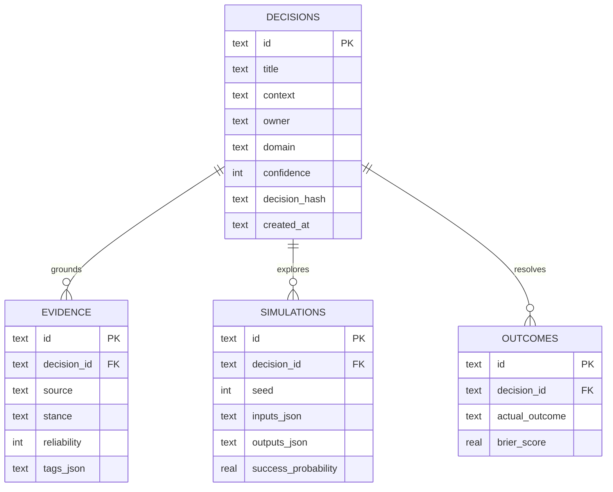

# FAULTLINE architecture

## System intent

FAULTLINE treats a consequential decision as a temporal object, not a final sentence. A record includes the belief state before commitment, the evidence available at that moment, model inputs and outputs, and the resolved outcome. This is what makes calibration and hindsight-resistant review possible.

## Runtime boundaries

### Presentation boundary

`app/FaultlineApp.tsx` owns interaction state and progressive enhancement. The initial control room server-renders with realistic product data. API failures never erase the product surface: deterministic simulation and evidence ranking can run locally, while the UI clearly reports when durable persistence is unavailable.

### Decision engine boundary

`lib/engine.ts` is pure and side-effect free. It contains:

- seeded pseudo-random generation;
- bounded Monte Carlo scenario simulation;
- hybrid evidence ranking;
- fault-score calculation;
- Brier calibration scoring.

Pure functions make the analytical behavior reproducible, testable, and portable to a queue worker or model-serving service later.

### Persistence boundary

D1 access stays in `db/`. Application handlers use parameterized Drizzle inserts or prepared D1 statements. Runtime initialization executes exactly one statement per prepared query and batches them. Generated SQL migrations are checked into `drizzle/` for controlled deployment.

### API boundary

Routes validate type, size, and numerical finiteness before invoking the engine or database:

- `/api/simulate` executes and optionally stores a simulation.
- `/api/retrieve` performs provenance-preserving retrieval.
- `/api/decisions` reads and seals decision commits.

## Data model

## Analytical choices

### Deterministic simulation

The scenario engine uses a seeded Mulberry32 generator plus a Box–Muller Gaussian transform. A fixed input and seed always produce the same result, which is critical for auditability and regression testing. Input variables are clamped to product-safe ranges, and a minimum of 500 paths prevents misleadingly sparse distributions.

### Explainable retrieval

The bundled retriever is intentionally small and inspectable. It combines exact title/tag matches, semantic term-group expansion, bounded body matches, reliability, and recency. Every result returns a reason. It never invents citations or generates prose from absent evidence.

Production evolution can replace semantic expansion with embeddings and a cross-encoder while keeping the same typed result contract and provenance requirements.

### Integrity, not blockchain theater

The ledger computes a SHA-256 digest across identity, content, owner, and timestamp. This detects accidental or unauthorized mutation of exported records. A production tamper-evident ledger should additionally hash-chain records, sign checkpoints with a managed key, and export to immutable retention storage.

## Production evolution

The current architecture has explicit seams for:

1. R2 document ingestion with D1 metadata.
2. Queue-backed parsing and claim extraction.
3. Embedding search plus lexical fusion.
4. Organization-aware authorization and row ownership.
5. Signed model cards and retrieval evaluation sets.
6. Outcome workflows and calibration dashboards.
7. Connector ingestion from document, CRM, issue, and warehouse systems.

No existing surface needs to be discarded to add these capabilities.
